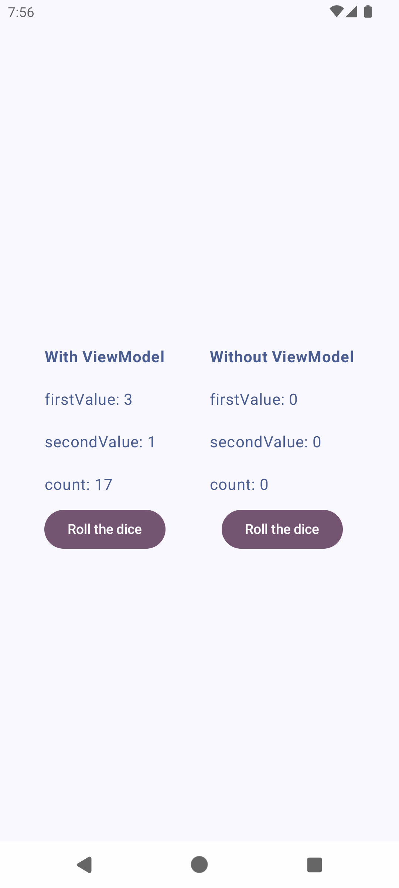

This is a study project I developed to explore and learn how to use `ViewModel` with `Jetpack Compose`. I aimed to create an app that was slightly more complex than usual.

## 🛠️ Technologies Used

- **Kotlin**: Main development language.
- **Jetpack Compose**: Declarative UI framework for Android.
- **ViewModel**: Android Jetpack component for state management.
- **Ktor**: Used for making network requests.

## 🔧 How to Run

1. Clone the repository:
    ```bash
    git clone https://github.com/HarukaYamamoto0/Linko.git
    ```
2. Open the project in Android Studio.
3. Build and run the app on an emulator or physical device.

## 📚 What I Learned

- How to use `ViewModel` to separate business logic from UI logic.
- Passing arguments between screens using type safety.
- Error handling.
- How to update Kotlin to version `2.0`.

## 📷 Screenshots


## 🤝 Contribution

This is a learning project, but I would be happy to receive feedback or suggestions. Feel free to open issues or submit pull requests.
